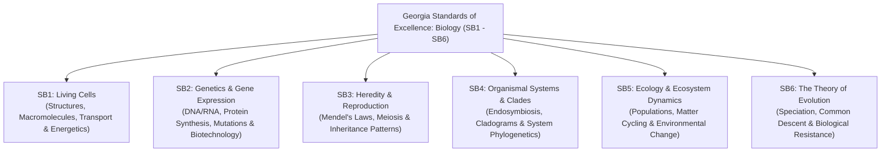

# Georgia Standards of Excellence (GSE) for Biology
### Course: High School Biology I Honors (Course Code: 26.01200)
### Georgia Department of Education (GaDOE) • Science Framework

---

## 🏛️ Course Overview & Framework

The Georgia Standards of Excellence in Biology are designed to provide foundational knowledge and scientific literacy for high school students. The curriculum integrates core disciplinary ideas with **Science and Engineering Practices (SEPs)** and **Crosscutting Concepts (CCCs)**, emphasizing:
* Active student investigation, inquiry, and evidence-based reasoning.
* Mathematical and computational thinking.
* Developing and using biological models.
* Communicating scientific claims supported by empirical evidence.

The state curriculum is structured around six overarching anchor standards (**SB1 through SB6**).

---

## 📑 Complete Standards Breakdown (SB1 – SB6)

---

### 🔬 Standard SB1: Living Cells — Structure, Function & Physiology
> **SB1. Obtain, evaluate, and communicate information to analyze the nature of the relationships between structures and functions in living cells.**

* **SB1.a:** Construct an explanation of how cell structures and organelles (including **nucleus, cytoplasm, cell membrane, cell wall, chloroplasts, lysosome, Golgi apparatus, endoplasmic reticulum, vacuoles, ribosomes, and mitochondria**) interact as a system to maintain homeostasis.
* **SB1.b:** Develop and use models to explain the role of cellular reproduction (including **binary fission, mitosis, and meiosis**) in maintaining genetic continuity.
* **SB1.c:** Construct arguments supported by evidence to relate the structure of macromolecules (**carbohydrates, proteins, lipids, and nucleic acids**) to their interactions in carrying out cellular processes.
* **SB1.d:** Plan and carry out investigations to determine the role of cellular transport (e.g., **active transport, passive transport, and osmosis**) in maintaining homeostasis.
* **SB1.e:** Ask questions to investigate and provide explanations about the roles of **photosynthesis and cellular respiration** in the cycling of matter and flow of energy within the cell (e.g., single-celled alga, ATP-ADP cycle).

---

### 🧬 Standard SB2: Genetics — Gene Expression & Biotechnology
> **SB2. Obtain, evaluate, and communicate information to analyze how genetic information is expressed in cells.**

* **SB2.a:** Construct an explanation of how the structures of **DNA and RNA** lead to the expression of information within the cell via the processes of **replication, transcription, and translation**.
* **SB2.b:** Construct an argument based on evidence to support the claim that inheritable genetic variations may result from:
  * New genetic combinations through meiosis (**crossing over, independent assortment, nondisjunction**);
  * Non-lethal errors occurring during replication (**insertions, deletions, substitutions**); and/or
  * Heritable mutations caused by environmental factors (**radiation, chemicals, viruses**).
* **SB2.c:** Ask questions to gather and communicate information about the use and ethical considerations of **biotechnology** in forensics, medicine, and agriculture (e.g., DNA fingerprinting, CRISPR, gene therapy, GMOs).

---

### 👨‍👩‍👧 Standard SB3: Heredity — Patterns of Inheritance
> **SB3. Obtain, evaluate, and communicate information to analyze how biological traits are passed on to successive generations.**

* **SB3.a:** Use Mendel’s laws (**segregation and independent assortment**) to ask questions and define problems that explain the role of meiosis in reproductive variability.
* **SB3.b:** Use mathematical models (e.g., **monohybrid and dihybrid Punnett squares, pedigrees**) to predict and explain patterns of inheritance (including dominant/recessive, incomplete dominance, codominance, multiple alleles, sex-linked inheritance, and polygenic traits).
* **SB3.c:** Construct an argument to support a claim about the relative advantages and disadvantages of **sexual and asexual reproduction** (e.g., genetic diversity vs. energy expenditure and reproductive rate).

---

### 🌳 Standard SB4: Organism Systems — Phylogenetics & Clades
> **SB4. Obtain, evaluate, and communicate information to illustrate the organization of interacting systems within single-celled and multi-celled organisms.**

* **SB4.a:** Construct an argument supported by scientific information to explain patterns in structures and function among clades of organisms, including the origin of eukaryotes by **endosymbiosis**. Clades should include: **archaea, bacteria, and eukaryotes (fungi, plants, animals)**.
* **SB4.b:** Analyze and interpret data to develop models (i.e., **cladograms and phylogenetic trees**) based on patterns of common ancestry and the theory of evolution to determine relationships among major groups of organisms.

---

### 🌍 Standard SB5: Ecology — Interdependence & Ecosystem Dynamics
> **SB5. Obtain, evaluate, and communicate information to assess the interdependence of all organisms on one another and their environment.**

* **SB5.a:** Plan and carry out investigations and analyze data to support explanations about factors affecting **biodiversity and populations** in ecosystems (e.g., population size, carrying capacity, density-dependent and density-independent limiting factors, and keystone species).
* **SB5.b:** Develop and use models to analyze the **cycling of matter and flow of energy** within ecosystems through the processes of photosynthesis and respiration (e.g., food chains, food webs, 10% energy rule pyramids, carbon cycle, nitrogen cycle, phosphorus cycle).
* **SB5.c:** Construct an argument to predict the impact of **environmental change** on the stability of an ecosystem (e.g., climate change, habitat destruction, invasive species, pollution, ocean acidification).

---

### 🦎 Standard SB6: Evolution — Natural Selection & Speciation
> **SB6. Obtain, evaluate, and communicate information to assess the theory of evolution.**

* **SB6.a:** Construct an explanation of how new understandings of Earth’s history, the emergence of new species from pre-existing species, and our understanding of genetics have influenced our understanding of biology.
* **SB6.b:** Analyze and interpret data to explain patterns in biodiversity that result from **speciation** (allopatric, sympatric, reproductive isolation).
* **SB6.c:** Construct an argument using valid and reliable sources to support the claim that evidence from **comparative morphology** (homologous, analogous, and vestigial structures), **embryology, biochemistry** (DNA and amino acid sequence homologies), and **the fossil record** support the theory that all living organisms are related by way of common descent.
* **SB6.d:** Develop and use mathematical models to support explanations of how undirected genetic changes in **natural selection and genetic drift** (bottleneck effect, founder effect, gene flow) have led to changes in populations of organisms (Hardy-Weinberg equilibrium principles).
* **SB6.e:** Develop a model to explain the role natural selection plays in causing **biological resistance** (e.g., antibiotic resistance in bacteria, pesticide resistance in insects, influenza antiviral evasion).

---

## 🗺️ South Forsyth High School Curriculum Unit Alignment

| Unit # | Course Unit Title | Primary GSE Standard | Key GSE Sub-Elements |
| :---: | :--- | :---: | :--- |
| **Unit 1** | Biochemistry & Enzymes | **SB1** | **SB1.c** (Macromolecules), enzyme catalytic kinetics |
| **Unit 2** | Cells & Cell Transport *(Current)* | **SB1** | **SB1.d** (Part 1: Transport & Osmosis) **SB1.a** (Part 2: Organelles & Cell Theory) |
| **Unit 3** | Cellular Energetics | **SB1** | **SB1.e** (Photosynthesis, Respiration & ATP Cycle) |
| **Unit 4** | Cellular Reproduction | **SB1** | **SB1.b** (Mitosis, Cell Cycle, Binary Fission) |
| **Unit 5** | Gene Expression | **SB2** | **SB2.a, SB2.b** (DNA, RNA, Transcription, Translation) |
| **Unit 6** | Meiosis & Genetics | **SB2 / SB3** | **SB2.b, SB3.a, SB3.b, SB3.c** (Meiosis, Punnett Squares, Heredity) |
| **Unit 7** | Biotechnology | **SB2 / SB4** | **SB2.c** (CRISPR, Cloning, Genetic Engineering), **SB4.a** |
| **Unit 8** | Evolution & Natural Selection | **SB4 / SB6** | **SB4.b, SB6.a, SB6.b, SB6.c, SB6.d, SB6.e** (Speciation, Fossils, Resistance) |
| **Unit 9** | Ecology & Ecosystems | **SB5** | **SB5.a, SB5.b, SB5.c** (Populations, Biomes, Energy Pyramids, Cycles) |
| **Unit 10** | Diversity of Life | **SB4** | **SB4.a, SB4.b** (Classification, 3 Domains, Cladograms) |

---

### 📌 Document Metadata
* **File Path:** `/Volumes/Backup/Antony/HighSchool/Grade9/Biology-Honors/Georgia_Standards_Biology_Full.md`
* **Authority:** Georgia Department of Education (GaDOE) Science Standards of Excellence
* **Course Code:** 26.01200 (Biology I Honors)
