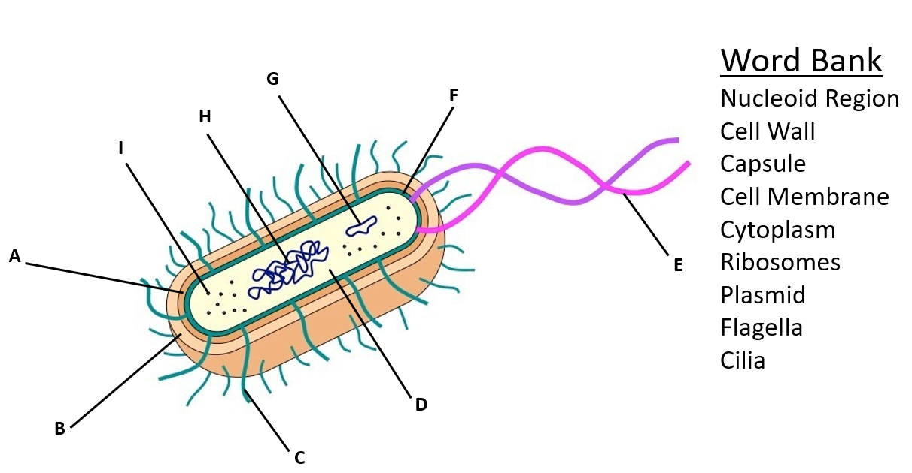
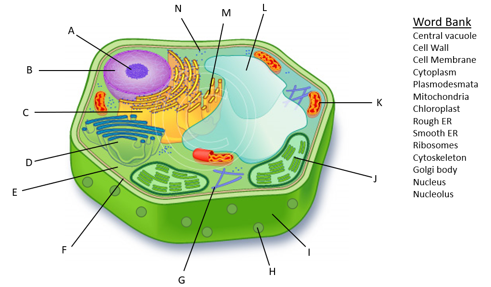
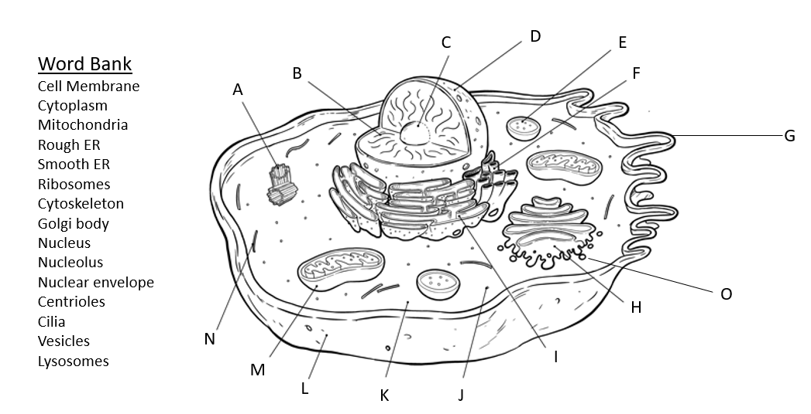

# Biology I Honors: Unit 2 Cells & Cell Transport Summative Master Study Guide & Answer Keys
**Course**: Biology I Honors • South Forsyth High School • Dr. Sarah Irwin (Room #371)  
**Assessment Dates**: Wednesday / Thursday, September 23–24, 2026  
**Exam Format**: Multiple Choice **AND** Short Answer Sections  
**State Standards Alignment**: GSE **SB1.a** (Cell structure & function) & **SB1.d** (Cell membrane & transport mechanisms)  

---

## 🎯 Executive Test Overview & Critical Focus Areas

Dr. Irwin explicitly noted on Canvas: ***"Keys will not be posted for these resources."***  
This master guide provides the complete, authoritative, and exhaustive worked solutions for both official review packets:
1. **[Cells Study Guide.docx.pdf](./Cells%20Study%20Guide.docx.pdf)**
2. **[Cell Membrane and Transport Study Guide.docx.pdf](./Cell%20Membrane%20and%20Transport%20Study%20Guide.docx.pdf)**

### High-Yield Short Answer Expectations:
* **The Endomembrane Protein Synthesis Relay**: Tracing a secretory protein from DNA transcription in the nucleus through export at the plasma membrane.
* **Organelle System Collaboration & "Cease to Collaborate" Failure Analysis**: Explaining how two organelles rely on one another, and constructing Claim-Evidence-Reasoning (CER) arguments predicting cellular consequences if one organelle malfunctions or is inhibited by a toxin.
* **Tonicity & Osmotic Pressure Scenarios**: Calculating concentration gradients and explaining physical changes in plant (turgor vs. plasmolysis) and animal cells (lysis vs. crenation).

---

## 📋 PART 1: Complete Answer Key — Cell Study Guide

### Question 1: Master Organelle Function & Location Matrix (22 Organelles)

| Organelle / Structure | Location (Plant / Animal / Bacteria) | Structure & Membrane Count | Primary Biological Function |
| :--- | :--- | :--- | :--- |
| **a. Nucleus** | Plant & Animal (**Eukaryotes only**) | Double membrane (nuclear envelope) with nuclear pores | Houses genetic material ($\text{DNA}$); controls cell activities, growth, and protein synthesis transcription. |
| **b. Chloroplasts** | Plant (**and photosynthetic algae**) | Double membrane; internal stacks of thylakoids (grana) suspended in stroma | Site of **photosynthesis**: converts light energy, $\text{CO}_2$, and $\text{H}_2\text{O}$ into chemical energy (glucose) and $\text{O}_2$. |
| **c. Mitochondria** | Plant & Animal (**All Eukaryotes**) | Double membrane; folded inner membrane (cristae) and fluid matrix | Site of **aerobic cellular respiration**: oxidizes pyruvate/glucose to produce $\text{ATP}$ chemical energy. |
| **d. Rough ER (RER)** | Plant & Animal | Single membrane; network of folded cisternae studded with ribosomes | Synthesizes, folds, and modifies secretory proteins and membrane proteins; packages them into transport vesicles. |
| **d. Smooth ER (SER)** | Plant & Animal | Single membrane; tubular network **free of ribosomes** | Synthesizes **lipids** (phospholipids, steroids), metabolizes carbohydrates, detoxifies drugs/toxins (liver), stores $\text{Ca}^{2+}$ ions. |
| **e. Cytoplasm / Cytosol** | **All cells** (Plant, Animal, Bacteria) | Semi-fluid gel matrix (water, salts, proteins) | Suspends organelles; medium for metabolic reactions (e.g., glycolysis, initial biochemical steps). |
| **f. Ribosomes** | **All cells** (Plant, Animal, Bacteria) | Non-membranous; composed of $\text{rRNA}$ and proteins (80S in eukaryotes, 70S in prokaryotes) | Site of **translation** (protein synthesis); translates $\text{mRNA}$ codons into polypeptide chains. |
| **g. Cell Membrane** | **All cells** (Plant, Animal, Bacteria) | Phospholipid bilayer embedded with proteins, cholesterol, and carbohydrates | Selectively permeable barrier regulating the entry and exit of substances; maintains cellular homeostasis. |
| **h. Golgi Apparatus** | Plant & Animal | Single membrane; flattened stacks of unattached cisternae (cis and trans faces) | **Receives, sorts, modifies, tags (glycosylation), and packages** proteins and lipids into vesicles for secretion or intracellular delivery. |
| **i. Lysosomes** | Animal (**Rare/controversial in plants**) | Single membrane; acidic interior containing hydrolytic digestive enzymes | Digests worn-out organelles (autophagy), food particles, and engulfed pathogens (phagocytosis); programed cell death (apoptosis). |
| **j. Vacuoles** | Plant (**Large Central Vacuole**) & Animal (**Small, multiple vacuoles**) | Single membrane (tonoplast in plants) | Storage of water, nutrients, pigments, and wastes; in plants, creates **turgor pressure** against the cell wall for structural rigidity. |
| **k. Cytoskeleton** | Plant & Animal (**Prokaryotes have protein homologues**) | Non-membranous network of protein fibers | Maintains cell shape, anchors organelles, enables cell motility, and facilitates intracellular transport. |
| **l. Centrioles** | Animal (**Absent in higher plants**, except some lower flagellated forms) | Non-membranous cylinder of 9 microtubule triplets ($9+0$ pattern) | Organizes the mitotic spindle during animal cell division; forms the base of cilia and flagella (basal body). |
| **m. Nucleolus** | Plant & Animal | Dense, non-membranous region inside the nucleus | Site of **ribosomal RNA ($\text{rRNA}$) transcription** and ribosome subunit assembly. |
| **n. Nuclear Membrane** | Plant & Animal | Double lipid bilayer (inner and outer nuclear membranes) | Separates the genetic material inside the nucleus from the cytoplasm; outer membrane is continuous with the Rough ER. |
| **o. Nuclear Pores** | Plant & Animal | Protein complexes spanning the nuclear envelope | Regulate macromolecular traffic: allows $\text{mRNA}$ and ribosomal subunits out, and proteins/enzymes (e.g., $\text{DNA}$ polymerase) in. |
| **p. Cell Wall** | Plant (**Cellulose**) & Bacteria (**Peptidoglycan**); also Fungi (**Chitin**) | Rigid extracellular layer outside plasma membrane | Provides structural support, mechanical strength, prevents osmotic lysis, and determines cell morphology. |
| **q. Plasmodesmata** | Plant only | Microscopic plasma membrane-lined cytoplasmic channels through cell walls | Connects neighboring plant cells for intercellular transport of water, ions, signaling molecules, and nutrients. |
| **r. Gap Junctions** | Animal only | Transcellular channels formed by protein rings called **connexons** | Allows direct chemical and electrical communication between neighboring animal cells (e.g., intercalated discs in cardiac muscle). |
| **s. Microfilaments** | Plant & Animal | Thin, helical actin protein filaments (~7 nm diameter) | Cell motility (amoeboid movement), muscle contraction (with myosin), cytoplasmic streaming, and cleavage furrow formation in cytokinesis. |
| **t. Microtubules** | Plant & Animal | Hollow cylinders of $\alpha$- and $\beta$-tubulin dimers (~25 nm diameter) | Structural highway for motor proteins (kinesin/dynein), mitotic spindle fibers during mitosis, structural core of cilia and flagella ($9+2$ array). |
| **u. Tight Junctions** | Animal only | Continuous watertight seals formed by claudins and occludins | Prevents fluid leakage between epithelial cells (e.g., lining of the gut and urinary bladder). |
| **v. Nucleoid Region** | Bacteria (**Prokaryotes only**) | Non-membrane-bound cytoplasmic region | Contains the single, circular double-stranded bacterial chromosome (genomic $\text{DNA}$). |

---

### Question 2: The 5 Historical Cell Scientists

| Scientist | Contribution & Discovery | Mnemonic / Anchor |
| :--- | :--- | :--- |
| **1. Robert Hooke (1665)** | Examined thin slices of cork under an early compound microscope; coined the word **"cell"** because the empty cellulose chambers resembled the small rooms (*cellulae*) of monks in a monastery. | *Hooke discovered Cork and named Cells.* |
| **2. Anton van Leeuwenhoek (1674)** | Improved microscope lens grinding; first to observe living microorganisms in pond water and dental scrapings; named them **"Animalcules"** (bacteria and protozoa). | *Leeuwenhoek saw Living Little Animalcules.* |
| **3. Matthias Schleiden (1838)** | German botanist who concluded that **all plants and plant tissues are composed of cells**. | *Schleiden = Plants (Botanist).* |
| **4. Theodor Schwann (1839)** | German zoologist who concluded that **all animals and animal tissues are composed of cells**. | *Schwann sounds like Swan (Animal/Zoologist).* |
| **5. Rudolf Virchow (1855)** | Proposed that **all cells arise from pre-existing cells** (*"Omnis cellula e cellula"*), disproving spontaneous generation. | *Virchow = Verification that cells come from other cells.* |

---

### Question 3: The 3 Tenets of the Cell Theory
1. **All living organisms are composed of one or more cells** (unicellular or multicellular).
2. **The cell is the most basic structural and functional unit of life**.
3. **All cells arise from pre-existing cells through cell division**.

---

### Question 4: Plant vs. Animal Cells (Venn Diagram Summary)

```
        PLANT CELLS ONLY                      SHARED STRUCTURES                     ANIMAL CELLS ONLY
  ┌───────────────────────────────┐     ┌───────────────────────────────┐     ┌───────────────────────────────┐
  │ • Rigid Cellulose Cell Wall   │     │ • Plasma / Cell Membrane      │     │ • Centrioles / Centrosomes    │
  │ • Chloroplasts (Photosynth.)  │     │ • Cytoplasm & Cytosol         │     │ • Lysosomes (prominent)       │
  │ • Large Central Vacuole       │ ─── │ • Ribosomes (80S)             │ ─── │ • Small, temporary vacuoles   │
  │   (Turgor Pressure)           │     │ • Nucleus & Nucleolus         │     │ • Gap Junctions               │
  │ • Plasmodesmata               │     │ • Mitochondria & ER (R/S)     │     │ • Tight Junctions & Desmosomes│
  │ • Square / Rectangular shape  │     │ • Golgi Apparatus & Vesicles  │     │ • Irregular / Round shape     │
  └───────────────────────────────┘     └───────────────────────────────┘     └───────────────────────────────┘
```

---

### Question 5: Prokaryotes vs. Eukaryotes

| Feature | Prokaryotes | Eukaryotes |
| :--- | :--- | :--- |
| **Evolutionary Age** | Ancient (~3.5 billion years ago) | More modern (~1.5–1.8 billion years ago) |
| **Nucleus** | **No** (genetic material is in a nucleoid) | **Yes** (enclosed in a double nuclear membrane) |
| **Membrane-Bound Organelles** | **None** (no mitochondria, chloroplasts, ER, Golgi) | **Present** (compartmentalized organelles) |
| **DNA Structure** | Single, circular chromosome; naked (no histones); circular plasmids | Multiple linear chromosomes bound to histone proteins |
| **Ribosome Size** | 70S (smaller) | 80S (cytosol/ER); 70S in mitochondria/chloroplasts |
| **Cell Size** | Small (0.1 – 5.0 $\mu\text{m}$) | Large (10 – 100 $\mu\text{m}$) |
| **Cell Division** | Binary fission | Mitosis and Meiosis |
| **Domains / Examples** | Domain **Bacteria** (*E. coli*, *Streptococcus*) & Domain **Archaea** (methanogens, halophiles) | Domain **Eukarya**: Animals, Plants, Fungi (*Yeast*, *Mushrooms*), and Protists (*Amoeba*, *Paramecium*) |

---

### Question 6 & 7: The Endomembrane System & Protein Synthesis Pathway

#### Definition:
The **Endomembrane System** is an interconnected network of internal membranes within eukaryotic cells that work together to synthesize, modify, package, transport, and degrade proteins and lipids.

#### Participating Organelles:
1. **Nucleus / Nuclear Envelope**
2. **Rough Endoplasmic Reticulum (RER)**
3. **Smooth Endoplasmic Reticulum (SER)**
4. **Transport Vesicles**
5. **Golgi Apparatus**
6. **Lysosomes**
7. **Vacuoles**
8. **Plasma Membrane**

#### Step-by-Step Secretory Protein Synthesis Relay:
1. **Transcription in Nucleus**: In the nucleus, a gene's $\text{DNA}$ sequence is transcribed into messenger RNA ($\text{mRNA}$).
2. **Nuclear Export**: $\text{mRNA}$ exits the nucleus via **nuclear pores** into the cytoplasm.
3. **Translation Initiation**: A **ribosome** binds to the $\text{mRNA}$. If the protein has a signal peptide, the ribosome docks onto the membrane of the **Rough ER**.
4. **Folding & Modification in RER**: The growing polypeptide chain enters the lumen of the **Rough ER**, where it folds into its 3D conformation and undergoes initial glycosylation.
5. **Vesicle Budding**: The protein is enclosed in a **transport vesicle** that pinches off the RER.
6. **Golgi Processing**: The vesicle travels along microtubules and fuses with the **cis-face** of the **Golgi apparatus**. The protein moves through cisternae, receiving carbohydrate modifications and molecular address tags.
7. **Packaging at Trans-Face**: At the **trans-face**, the protein is sorted into:
   * A **secretory vesicle** (destined for exocytosis at the cell membrane).
   * Or a **lysosome** (if it contains hydrolytic enzymes).
8. **Exocytosis**: The secretory vesicle fuses with the **plasma membrane**, releasing the protein (e.g., insulin) outside the cell.

---

### Question 8: Prokaryotes vs. Viruses (Why Viruses are Non-Living)

| Characteristic | Bacteria (Prokaryotes) | Viruses (Acellular Particles) |
| :--- | :--- | :--- |
| **Cellular Organization** | Complete unicellular organism with membrane, cytoplasm, and ribosomes | Acellular (no membrane, no cytoplasm, no organelles, no ribosomes) |
| **Structure** | Phospholipid bilayer, peptidoglycan wall, nucleoid $\text{DNA}$ | Protein coat (**capsid**) enclosing genetic material ($\text{DNA}$ or $\text{RNA}$) |
| **Metabolism** | Autonomous metabolic pathways; generates own $\text{ATP}$ | **No independent metabolism**; cannot generate or utilize $\text{ATP}$ |
| **Reproduction** | Autonomous reproduction via **binary fission** | **Obligate intracellular parasite**: requires host cell machinery to replicate |
| **Response to Antibiotics** | Susceptible to antibiotics (target cell wall or 70S ribosomes) | **Immune to antibiotics** (antibiotics do not target viruses) |

#### Why Viruses are Not Considered Living:
1. **Do not consist of cells** (violates the foundational tenet of Cell Theory).
2. **Cannot perform metabolism** or energy processing independently.
3. **Cannot maintain internal homeostasis**.
4. **Cannot reproduce independently** without hijacking host enzymes and ribosomes.

---

### Question 9: Cell Diagram Labeling Keys (Bacteria, Plant & Animal)

#### 1. Bacteria (Prokaryotic) Cell Diagram (Matching Word Bank)


| Letter | Organelle / Structure | Word Bank Term | Biological Description & Role |
| :---: | :--- | :--- | :--- |
| **A** | **Cell Wall** | `Cell Wall` | Rigid middle protective envelope layer made of peptidoglycan. |
| **B** | **Capsule** | `Capsule` | Outermost sticky protective polysaccharide sheath. |
| **C** | **Cilia (Pili)** | `Cilia` | Hair-like surface protein filaments for adhesion and conjugation. |
| **D** | **Ribosomes** | `Ribosomes` | 70S ribonucleoprotein particles synthesizing proteins in cytosol. |
| **E** | **Flagella** | `Flagella` | Long whip-like helical appendage for bacterial locomotion. |
| **F** | **Cell Membrane** | `Cell Membrane` | Innermost phospholipid bilayer regulating transport. |
| **G** | **Plasmid** | `Plasmid` | Small circular extrachromosomal DNA ring carrying auxiliary genes. |
| **H** | **Nucleoid Region** | `Nucleoid Region` | Region containing the circular double-stranded genomic DNA chromosome. |
| **I** | **Cytoplasm** | `Cytoplasm` | Internal aqueous ground substance suspending cellular contents. |

#### 2. Plant (Eukaryotic) Cell Diagram (Matching Word Bank)


| Letter | Organelle / Structure | Word Bank Term | Biological Description & Role |
| :---: | :--- | :--- | :--- |
| **A** | **Nucleolus** | `Nucleolus` | Dense intra-nuclear factory for rRNA synthesis and ribosome assembly. |
| **B** | **Nucleus** | `Nucleus` | Double-membrane genetic control center housing chromatin. |
| **C** | **Rough ER** | `Rough ER` | Ribosome-studded folded membrane cisternae for secretory protein folding. |
| **D** | **Golgi body** | `Golgi body` | Stacks of flattened membrane sacs for sorting, modifying, and shipping proteins. |
| **E** | **Cytoplasm** | `Cytoplasm` | Cytosol gel suspending organelles and enzymes. |
| **F** | **Cell Membrane** | `Cell Membrane` | Selectively permeable lipid bilayer inside the cell wall. |
| **G** | **Cytoskeleton** | `Cytoskeleton` | Dynamic protein microfilaments and microtubules for internal support. |
| **H** | **Plasmodesmata** | `Plasmodesmata` | Microscopic membrane-lined tunnels traversing cell walls to connect adjacent cells. |
| **I** | **Cell Wall** | `Cell Wall` | Outer rigid cellulose wall resisting osmotic pressure and providing shape. |
| **J** | **Chloroplast** | `Chloroplast` | Double-membrane photosynthesis organelle with thylakoid grana. |
| **K** | **Mitochondria** | `Mitochondria` | Aerobic cellular respiration organelle generating ATP. |
| **L** | **Central vacuole** | `Central vacuole` | Huge fluid reservoir exerting turgor pressure against the cell wall. |
| **M** | **Smooth ER** | `Smooth ER` | Tubular membrane network synthesizing lipids and detoxifying chemicals. |
| **N** | **Ribosomes** | `Ribosomes` | Translation units floating free in cytoplasm or docking on RER. |

#### 3. Animal (Eukaryotic) Cell Diagram (Matching Word Bank)


| Letter | Organelle / Structure | Word Bank Term | Biological Description & Role |
| :---: | :--- | :--- | :--- |
| **A** | **Centrioles** | `Centrioles` | Paired barrel-shaped microtubule cylinders organizing the mitotic spindle. |
| **B** | **Nucleus** | `Nucleus` | Spherical organelle containing linear chromosomes and chromatin. |
| **C** | **Nucleolus** | `Nucleolus` | Dark staining core assembling ribosomal subunits. |
| **D** | **Nuclear envelope** | `Nuclear envelope` | Perforated double membrane regulating macromolecular transit. |
| **E** | **Lysosomes** | `Lysosomes` | Acidic hydrolytic digestion vesicle for autophagy and waste breakdown. |
| **F** | **Smooth ER** | `Smooth ER` | Lipid and steroid synthesis network; calcium storage. |
| **G** | **Cilia (or Microvilli)**| `Cilia` | Plasma membrane surface folds and extensions. |
| **H** | **Golgi body** | `Golgi body` | Sorting hub attaching carbohydrate address tags to outgoing cargo. |
| **I** | **Vesicles** | `Vesicles` | Membrane transport bubbles ferrying cargo along microtubules. |
| **J** | **Ribosomes** | `Ribosomes` | Free cytosolic 80S ribosomes synthesizing domestic cellular proteins. |
| **K** | **Cytoplasm** | `Cytoplasm` | Intracellular fluid matrix. |
| **L** | **Cell Membrane** | `Cell Membrane` | Outer boundary regulating entry and exit. |
| **M** | **Mitochondria** | `Mitochondria` | Oval powerhouse with folded inner cristae producing cellular ATP. |
| **N** | **Cytoskeleton** | `Cytoskeleton` | Actin microfilaments and tubulin microtubules maintaining geometry. |
| **O** | **Rough ER** | `Rough ER` | Extensive folded membrane network coated with ribosomes. |

---

### Question 10: Organelle System Collaboration & "Cease to Collaborate" Failure Analysis (Short Answer CER Preparation)

This is the exact table from Page 3 of Dr. Irwin's Study Guide:

| Organelles / Structures | Primary Functions | How They Collaborate in the Cell | Consequence If They Cease to Collaborate (Cell Failure / Pathology) |
| :--- | :--- | :--- | :--- |
| **1. Mitochondria & Chloroplast** | • **Chloroplast**: Uses sunlight to convert $\text{CO}_2 + \text{H}_2\text{O} \to \text{C}_6\text{H}_{12}\text{O}_6 + \text{O}_2$.<br>• **Mitochondria**: Breaks down $\text{C}_6\text{H}_{12}\text{O}_6 + \text{O}_2 \to \text{CO}_2 + \text{H}_2\text{O} + \text{ATP}$. | Direct metabolic coupling in plant cells. Chloroplasts synthesize glucose and $\text{O}_2$, which fuel mitochondrial aerobic respiration. Mitochondria release $\text{CO}_2$ and $\text{H}_2\text{O}$, which are the raw reactants for photosynthesis. | If chloroplasts fail or uncouple from mitochondria, the plant cell exhausts its stored glucose, depriving mitochondria of substrate. Cellular $\text{ATP}$ levels plummet, cellular transport stops, and the cell starves and dies. |
| **2. Cell Wall & Central Vacuole** | • **Cell Wall**: Rigid cellulose matrix providing counter-pressure.<br>• **Central Vacuole**: Stores water and generates outward hydrostatic pressure. | Together they create **turgor pressure**. The central vacuole fills with water, swelling outward. The rigid cell wall pushes back, preventing lysis and keeping the plant upright and rigid. | If the central vacuole loses water (in hypertonic conditions), outward pressure drops. The plasma membrane pulls away from the cell wall (**plasmolysis**). The plant wilts and undergoes mechanical collapse. |
| **3. Ribosome & Rough ER (RER)** | • **Ribosome**: Translates $\text{mRNA}$ into amino acid chains.<br>• **RER**: Membrane lumen that folds and packages proteins. | Ribosomes dock onto translocon pores on the RER surface, injecting synthesized polypeptide chains directly into the RER lumen for chaperone-assisted folding and disulfide bond formation. | Polypeptides synthesized by detached ribosomes fail to enter the ER lumen. Secretory and membrane proteins remain unfolded or aggregate in the cytosol, halting export and triggering the unfolded protein response ($\text{UPR}$) leading to apoptosis. |
| **4. Rough ER & Golgi Apparatus** | • **RER**: Packages folded proteins into transport vesicles.<br>• **Golgi**: Modifies, sorts, and ships proteins. | RER buds off COPII-coated transport vesicles containing folded proteins. These vesicles travel along microtubules and fuse with the *cis*-Golgi cisternae to deliver cargo for enzymatic processing. | Vesicle trafficking halts. Proteins accumulate inside the RER, causing toxic ER dilation. The Golgi starves of substrate, secretion ceases, and lysosomes cannot receive hydrolytic enzymes, creating cellular waste accumulation. |
| **5. Golgi Vesicles & Vacuoles / Lysosomes** | • **Golgi Vesicles**: Pinch off *trans*-Golgi carrying acid hydrolases.<br>• **Vacuoles / Lysosomes**: Acidic digestive and storage organelles. | Golgi adds mannose-6-phosphate tags to hydrolytic enzymes, packaging them into clathrin-coated vesicles that bud off and fuse with endosomes/vacuoles to mature into functional, active lysosomes. | Lysosomes never receive digestive enzymes. Undigested macromolecules (lipids, glycogen) accumulate inside defective lysosomes, causing lethal cellular swelling (analogous to human **Tay-Sachs disease** or inclusion-cell disease). |

---

## 📋 PART 2: Complete Answer Key — Cell Membrane and Transport Study Guide

### 1. Phospholipids & Bilayer Architecture
* **What is a Phospholipid?** An amphipathic lipid molecule consisting of:
  1. **Phosphate group** + **Glycerol backbone**: Polar, hydrophilic head (attracted to water).
  2. **Two fatty acid chains**: Non-polar, hydrophobic tails (repelled by water; one saturated, one unsaturated with a cis-double bond kink).
* **The 3 Chemical Components**: Glycerol molecule, phosphate group (often with a charged nitrogenous base like choline), and two hydrocarbon fatty acid tails.
* **Cell Membrane Structure (Fluid Mosaic Model)**:
  * **Phospholipid Bilayer**: Hydrophilic heads face the aqueous extracellular fluid and cytosol; hydrophobic tails point inward, shielded from water.
  * **Integral / Transmembrane Proteins**: Span the entire hydrophobic core; act as transport channels, carriers, receptors, or enzymes.
  * **Peripheral Proteins**: Loosely bound to the outer or inner membrane surface; function in signaling and cytoskeletal attachment.
  * **Cholesterol**: Temperature buffer interspersed among fatty acid tails. Prevents membrane from freezing at low temperatures and stabilizes membrane from becoming overly fluid at high temperatures.
  * **Glycoproteins & Glycolipids**: Carbohydrate chains attached to proteins or lipids on the extracellular surface; function in cell-to-cell recognition, adhesion, and immune identification.

---

### 2. Selective Permeability
* **Definition**: A property of cellular membranes that allows certain substances to pass through while preventing or regulating the passage of others.
* **Mechanism**:
  * **Can Pass Freely (Simple Diffusion)**: Small, non-polar, hydrophobic molecules (e.g., $\text{O}_2$, $\text{CO}_2$, $\text{N}_2$, steroids) and very tiny uncharged polar molecules (slowly, e.g., $\text{H}_2\text{O}$).
  * **Cannot Pass Freely (Requires Transport Proteins)**:
    1. **Ions and Charged Particles** ($\text{Na}^+, \text{K}^+, \text{Cl}^-, \text{Ca}^{2+}$): Cannot penetrate the non-polar hydrocarbon tail core.
    2. **Large Polar Molecules** (Glucose, sucrose, amino acids): Too bulky and polar to traverse the hydrophobic barrier.

---

### 3. Passive Transport (3 Types)
Passive transport requires **zero cellular metabolic energy ($\text{0 ATP}$)** and moves solutes **down their concentration gradient** (from **HIGH** concentration to **LOW** concentration).

1. **Simple Diffusion**: Net movement of small, non-polar molecules directly across the phospholipid bilayer from high to low concentration until dynamic equilibrium is reached.
2. **Facilitated Diffusion**: Passive movement of polar or charged molecules down their gradient through transmembrane proteins.
   * **Channel Proteins**: Hydrophilic tunnels (e.g., aquaporins for water, ion channels) that allow rapid flow without changing shape.
   * **Carrier Proteins**: Undergo subtle conformational (shape) changes to bind and shuttle specific solutes (e.g., GLUT glucose transporters) across the membrane.
3. **Osmosis**: The passive net diffusion of **free water molecules** across a selectively permeable membrane from an area of **lower solute concentration (high free water)** to an area of **higher solute concentration (low free water)**.

---

### 4. Osmotic Solutions & Cell Responses

```
                           HYPOTONIC SOLUTION                       ISOTONIC SOLUTION                       HYPERTONIC SOLUTION
Solute Concentration:   [Solute]outside < [Solute]inside       [Solute]outside = [Solute]inside        [Solute]outside > [Solute]inside
Free Water:             Higher outside                         Equal both sides                        Lower outside
Net Water Movement:     INTO the cell                          NO NET MOVEMENT (Dynamic Eq.)           OUT OF the cell

ANIMAL CELL:            Swells and BURSTS (LYSIS) ☹           NORMAL / HEALTHY ☺                      SHRIVELS / CREATES (CRENATION) ☹
PLANT CELL:             TURGID / NORMAL / RIGID ☺              FLACCID / LIMP :/                       PLASMOLYZED (Membrane shrinks) ☹
```

#### Why Plants and Animals Differ:
* **Animal cells** lack a cell wall; they require an **isotonic environment** to prevent osmotic lysis.
* **Plant cells** have a rigid cellulose cell wall; they require a **hypotonic environment** so water drives high **turgor pressure** inside the central vacuole, pushing against the cell wall to keep stems and leaves erect.

---

### 5. Active Transport (3 Types)
Active transport requires **cellular metabolic energy ($\text{ATP}$)** and moves substances **against their concentration gradient** (from **LOW** concentration to **HIGH** concentration).

1. **Molecular Pumps (Primary Active Transport)**: Transmembrane carrier proteins hydrolyze $\text{ATP}$ directly to pump ions against their electrochemical gradient.
   * *Flagship Example*: The **Sodium-Potassium ATPase Pump ($\text{Na}^+/\text{K}^+$ Pump)**: Hydrolyzes $1\ \text{ATP}$ to pump **$3\ \text{Na}^+$ ions OUT** of the cell and **$2\ \text{K}^+$ ions IN**, establishing resting membrane potential in neurons and muscle cells.
2. **Endocytosis**: Bulk transport moving large macromolecules, liquids, or whole cells **INTO** the cell via membrane invagination and vesicle formation.
   * **Phagocytosis ("Cellular Eating")**: Membrane engulfs large, solid particles or whole cells (e.g., white blood cell engulfing bacteria) into a phagosome, which fuses with a lysosome.
   * **Pinocytosis ("Cellular Drinking")**: Membrane invaginates to take in droplets of extracellular fluid containing dissolved solutes non-specifically.
   * **Receptor-Mediated Endocytosis**: Membrane receptors bind specific target ligands (e.g., $\text{LDL}$ cholesterol); coated pits (clathrin) invaginate to bring ligands in with high specificity.
3. **Exocytosis**: Bulk transport moving substances **OUT OF** the cell. Secretory vesicles transport waste or synthesized proteins from the Golgi, dock and fuse with the plasma membrane, and release their contents into the extracellular space.

---

### 6. Situation Classification Table (Page 3 of Study Guide)

| Scenario / Situation | Type of Transport | Form of Transport | Direction / Tonicity |
| :--- | :--- | :--- | :--- |
| **Oxygen moving from your lungs to your bloodstream** | **Passive** | **Simple Diffusion** | High concentration in alveoli $\to$ Low concentration in deoxygenated blood capillaries. |
| **Transport of hormones from one body tissue to another** | **Active (Bulk)** | **Exocytosis** (release) & **Receptor-Mediated Endocytosis** (uptake) | Vesicle fusion releasing hormones OUT into bloodstream; target cells uptake via receptors. |
| **Freshwater fish is released into a marine environment** | **Passive** | **Osmosis** | Environment is **HYPERTONIC** relative to fish body fluids; water rushes **OUT** of fish cells, causing severe dehydration and crenation. |
| **A marine shark wanders into fresh waters in search of prey** | **Passive** | **Osmosis** | Environment is **HYPOTONIC** relative to shark body fluids; water rushes **INTO** shark cells, causing cellular swelling and osmotic stress. |
| **Import of food particles to be used to generate ATP** | **Active (Bulk)** | **Phagocytosis / Endocytosis** | Large nutrient particles moved **INTO** the cell via vesicles. |

---

## 🗓️ 2-Day Hour-by-Hour Master Study Plan (Countdown to Summative)

### Day 1: Tuesday, September 22 (Organelles & Endomembrane Mastery)
* **4:00 PM – 5:00 PM**: Review the **22-Organelle Master Matrix**. Memorize plant-specific vs. animal-specific structures.
* **5:00 PM – 6:00 PM**: Draw the **Endomembrane Protein Synthesis Relay** on paper from memory (Nucleus $\to$ RER $\to$ Golgi $\to$ Vesicle $\to$ Exocytosis).
* **6:00 PM – 7:00 PM**: Dinner break & mental rest.
* **7:00 PM – 8:30 PM**: Drill the **5 "Cease to Collaborate" Scenarios** from Part 1, Question 10. Write out CER responses for organelle failure.
* **8:30 PM – 9:30 PM**: Complete Unit 2 practice test in the interactive portal ([test-doc-02](file:///Volumes/Backup/Antony/HighSchool/Grade9/Biology-Honors-V2/units/unit-02-cells-and-transport/tests/test-doc-02-cells-organelles.html)).

### Day 2: Wednesday, September 23 (Membrane, Transport & CER Polish)
* **4:00 PM – 5:15 PM**: Review **Fluid Mosaic Model & Selective Permeability**. Practice drawing a phospholipid with polar head and nonpolar tails.
* **5:15 PM – 6:30 PM**: Master the **Tonicity Matrix**: Hypotonic, Isotonic, Hypertonic. Drill plant (turgid vs. plasmolyzed) vs. animal (lysed vs. crenated).
* **6:30 PM – 7:30 PM**: Dinner break.
* **7:30 PM – 8:45 PM**: Review Active Transport: Sodium-Potassium pump ($3\ \text{Na}^+\ \text{out} / 2\ \text{K}^+\ \text{in}$), Phagocytosis, Pinocytosis, Receptor-Mediated Endocytosis, and Exocytosis.
* **8:45 PM – 9:30 PM**: Take the **55-Question Master Exam** ([test-unit-2-part-1-comprehensive-mastery.html](file:///Volumes/Backup/Antony/HighSchool/Grade9/Biology-Honors-V2/units/unit-02-cells-and-transport/tests/test-unit-2-part-1-comprehensive-mastery.html)). Review any missed questions.
* **9:30 PM**: Rest and sleep early for peak cognitive performance on exam day!
