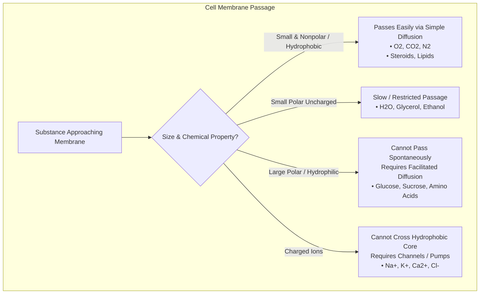

# Unit 2 (Part 1): Cell Membrane and Transport

**Source:** `HB Unit 2 (Part 1)_ Cell Membrane & Transport PPT.pdf`  
**Course:** Biology I Honors — Unit 2: Cells and Cell Transport  
**Document Type:** Comprehensive Lecture & Slide Guide

---

## 🧭 Unit Outline & Core Themes

1. **Cell Membrane Structure & The Fluid Mosaic Model**
2. **Macromolecules in the Membrane & Membrane Functions (TRACIE)**
3. **Selective Permeability & Membrane Transport Overview**
4. **Passive Transport Mechanisms:** Simple Diffusion, Osmosis, and Facilitated Diffusion
5. **Tonicity & Osmotic Effects:** Animal vs. Plant Cells
6. **Active Transport Mechanisms:** Exocytosis, Endocytosis (Phago, Pino, Receptor-Mediated), and Molecular Pumps ($Na^+/K^+$ ATPase)
7. **Success Criteria & Study Objectives**

---

## 1. Cell Membrane Structure

### The Phospholipid Bilayer
- The cell membrane (plasma membrane) is primarily composed of a double layer of **phospholipids**.
- **Amphipathic Nature of Phospholipids:**
  - **Hydrophilic (Water-Loving) Head:** Composed of a glycerol molecule and a charged phosphate group. Polar; faces outward toward the aqueous extracellular fluid and intracellular cytoplasm.
  - **Hydrophobic (Water-Fearing) Tails:** Composed of two long nonpolar fatty acid chains. Face inward toward each other, shielding themselves from water to create a hydrophobic core.

### The Fluid Mosaic Model
- **"Fluid":** Phospholipids and embedded proteins are not static; they move laterally and flex within the plane of the membrane.
- **"Mosaic":** The membrane is embedded with a diverse array of biomolecules including integral proteins, peripheral proteins, glycoproteins, glycolipids, and cholesterol.

---

## 2. Macromolecules of the Membrane & Their Roles

| Membrane Component | Macromolecule Class | Location | Primary Biological Role |
|:---|:---|:---|:---|
| **Phospholipids** | Lipid | Bilayer framework | Forms the continuous, selectively permeable structural barrier |
| **Cholesterol** | Lipid (Steroid with 4 fused carbon rings) | Embedded between phospholipid tails | **Fluidity buffer:** Keeps the membrane from freezing and packing too tightly in cold temperatures, and prevents it from becoming overly fluid/leaky in warm temperatures |
| **Integral Proteins** | Protein | Spans across the hydrophobic core (transmembrane) | Channels, transporters, enzymes, signal transduction receptors |
| **Peripheral Proteins** | Protein | Loosely attached to inner or outer membrane surface | Cytoskeletal anchoring, intracellular signaling pathways |
| **Glycolipids & Glycoproteins** | Carbohydrate + Lipid / Protein | Protrude outward from extracellular surface | Cellular "identification badges" for cell recognition, tissue organization, and immune identification |

### Membrane Functions Mnemonic: TRACIE
- **T — Transport:** Channel and carrier proteins moving solutes across the bilayer.
- **R — Receptors:** Peptide hormones and signal molecules binding to surface proteins to initiate intracellular cascades.
- **A — Anchorage:** Cytoskeletal attachments inside and extracellular matrix (ECM) attachments outside.
- **C — Cell Recognition:** Carbohydrate chains (MHC proteins, ABO blood markers) allowing immune self-recognition.
- **I — Intercellular Joinings:** Tight junctions and desmosomes hooking adjacent cells together.
- **E — Enzymatic Activity:** Metabolic enzymes grouped directly within the membrane.

---

## 3. Selective Permeability

The hydrophobic core of the bilayer dictates which molecules can cross spontaneously:

---

## 4. Passive Transport

### Fundamental Principles
- **No Cellular Energy (ATP) Required.**
- Molecules move **down** (with) their concentration gradient from an area of **high concentration to low concentration**.
- Molecules continue moving until **dynamic equilibrium** is reached (particles are distributed evenly and continue crossing at equal rates in both directions).

### Forms of Passive Transport

#### A. Simple Diffusion
- Spontaneous net movement of small, nonpolar solute molecules directly through the phospholipid bilayer from high concentration to low concentration.
- *Examples:*
  - Oxygen ($O_2$) diffusing from lung alveoli into bloodstream capillaries.
  - Carbon dioxide ($CO_2$) diffusing out of metabolically active cells into blood for exhalation.

#### B. Facilitated Diffusion
- Passive movement of large, polar, or charged molecules across the membrane with the assistance of specialized transmembrane transport proteins.
- Still moves **down** the concentration gradient without energy.
- **Two Main Classes of Transport Proteins:**
  1. **Channel Proteins:** Provide a hydrophilic pore through which specific ions or water pass rapidly.
     - *Aquaporins:* Specialized channel proteins dedicated to rapid water transport (much faster than simple diffusion through the lipid bilayer).
  2. **Carrier Proteins:** Bind to a specific solute molecule, undergo a subtle conformational change in shape, and release the solute on the other side.
     - *Example:* **Glucose transporters (GLUT)** moving glucose into muscle and liver cells.

#### C. Osmosis
- The specific simple diffusion of **water molecules** across a selectively permeable membrane.
- Water diffuses from an area of **higher water concentration (lower solute concentration)** to an area of **lower water concentration (higher solute concentration)**.
- **Water Potential:** Water moves down its water potential gradient from high water potential $
ightarrow$ low water potential.

---

## 5. Tonicity & Solution Types

Tonicity describes the relative solute concentration of an extracellular solution compared to the intracellular fluid of a cell:

| Solution Type | Definition | Water Direction | Effect on Animal Cells | Effect on Plant Cells |
|:---|:---|:---|:---|:---|
| **Hypertonic** | Solute concentration is **higher** outside the cell | Net water moves **OUT** of cell | Cell shrivels / shrinks (**Crenation**) | Cytoplasm shrinks away from wall (**Plasmolysis**); plant wilts |
| **Isotonic** | Solute concentration is **equal** inside and outside | **Dynamic equilibrium** (no net movement) | Cell maintains normal size & shape (**Homeostasis**) | Flaccid / limp; lack of internal turgor |
| **Hypotonic** | Solute concentration is **lower** outside the cell | Net water moves **INTO** cell | Cell swells and bursts (**Lysis / Cytolysis**) | Cell swells against rigid wall; becomes firm (**Turgid**; ideal plant state) |

### Plant Turgor Pressure
- **Turgor Pressure:** The hydrostatic pressure exerted by the fluid in the large central vacuole pushing the plasma membrane against the rigid cellulose cell wall.
- Enables herbaceous plants to stand upright against gravity.
- Prevents plant cells from bursting in hypotonic environments.

---

## 6. Active Transport

### Fundamental Principles
- **Requires Metabolic Energy in the form of ATP.**
- Moves substances **against (up)** their concentration gradient, from an area of **low concentration to high concentration**.
- Essential for maintaining steep electrochemical and concentration gradients necessary for cell survival.

### Forms of Active Transport

#### A. Bulk Transport: Exocytosis
- Transport of large molecules, macromolecular complexes, or fluids **out of the cell** in bulk.
- Intracellular vesicles produced by the Golgi apparatus migrate to, fuse with, and become part of the plasma membrane, dumping vesicle contents into extracellular space.
- *Examples:*
  - Secretion of peptide hormones (e.g., insulin secreted by pancreatic beta cells).
  - Secretion of neurotransmitters across synaptic clefts between neurons.
  - Export of polysaccharides and glycoproteins to build plant cell walls.

#### B. Bulk Transport: Endocytosis
- Process by which cells take in macromolecules, fluids, or whole cells by forming new vesicles derived from inward folding (invagination) of the plasma membrane.
- **Three Types of Endocytosis:**
  1. **Pinocytosis ("Cell Drinking"):** Non-specific uptake of extracellular fluid and small dissolved droplets into tiny microvesicles.
  2. **Phagocytosis ("Cell Eating"):** Cellular engulfment of large, solid particles (such as cellular debris or bacteria) using pseudopodia, enclosing them into a large phagosome/vacuole which then fuses with a lysosome for degradation.
     - *Examples:* Macrophages destroying pathogenic bacteria; Amoeba feeding on paramecium.
  3. **Receptor-Mediated Endocytosis:** Highly selective uptake triggered when specific extracellular ligands (e.g., peptide hormones, LDL cholesterol complexes) bind to specialized transmembrane receptor proteins clustered in clathrin-coated pits.

#### C. Primary Molecular Active Transport: The Sodium-Potassium Pump ($Na^+/K^+$ ATPase)
- A vital carrier protein pump embedded in animal plasma membranes that uses ATP hydrolysis to maintain ion concentration differences across the membrane.
- **Stoichiometry & Direction:**
  - Pumps **3 Sodium ions ($Na^+$) OUT** of the cell.
  - Pumps **2 Potassium ions ($K^+$) INTO** the cell.
  - Consumes **1 molecule of ATP** per cycle.
- **Electrochemical Gradient:** Because 3 positive charges exit for every 2 positive charges that enter, the interior of the cell becomes slightly negative relative to the outside, establishing the resting membrane potential essential for nerve impulse transmission and muscle contraction.
- **"Salty Banana" Mnemonic:**
  - High $Na^+$ on the outside ("salty surface").
  - High $K^+$ on the inside ("potassium-rich banana interior").

---

## 7. Master Summary: Passive vs. Active Transport

| Characteristic | Passive Transport | Active Transport |
|:---|:---|:---|
| **Cellular Energy (ATP)?** | No | **Yes (Required)** |
| **Direction of Movement** | Down gradient (High $
ightarrow$ Low) | Against gradient (Low $
ightarrow$ High) |
| **Types Included** | • Simple diffusion • Osmosis • Facilitated diffusion | • Protein Pumps ($Na^+/K^+$) • Exocytosis • Endocytosis (Phago, Pino, Receptor) |
| **Transport Proteins Needed?** | Only for facilitated diffusion | Yes (for molecular pumps) or vesicle machinery |
| **Ultimate Goal** | Reach dynamic equilibrium | Establish/maintain concentration gradients |

---

## 🎯 Success Criteria Checklist

### Passive Cell Transport Mastery
- [x] Describe concentration gradient and dynamic equilibrium.
- [x] Compare simple diffusion, osmosis, and facilitated diffusion.
- [x] Predict direction of water flow given solute concentrations.
- [x] Identify cell behavior in isotonic, hypertonic, and hypotonic solutions.
- [x] Contrast animal cell lysis/crenation with plant cell turgor/plasmolysis.
- [x] Describe characteristics of molecules utilizing channel and carrier proteins (e.g., GLUT, aquaporins).

### Active Cell Transport Mastery
- [x] Differentiate active transport from passive transport across energy, gradient, and mechanism.
- [x] Compare exocytosis and endocytosis.
- [x] Distinguish pinocytosis, phagocytosis, and receptor-mediated endocytosis.
- [x] Describe the operation, ion stoichiometry, and physiological role of the $Na^+/K^+$ pump.
