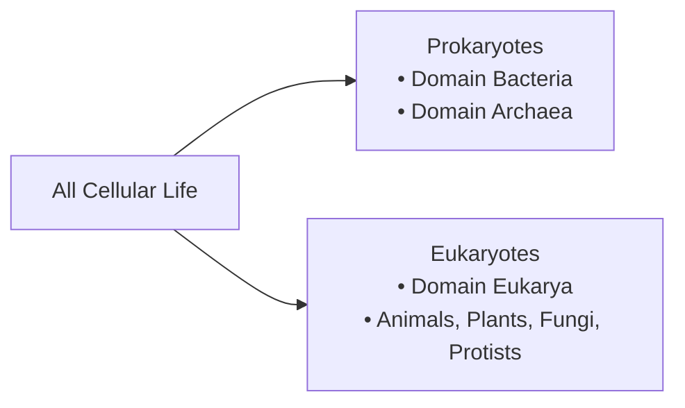

# Unit 2 (Part 2): Cell Theory and Cell Structure

**Source:** `HB Unit 2 (Part 2)_ Cell Theory & Structure PPT (26-27.pdf`  
**Course:** Biology I Honors — Unit 2: Cells and Cell Transport  
**Document Type:** Comprehensive Lecture & Slide Guide

---

## 📜 1. History of Cell Discovery & The Cell Theory

The development of the microscope led to landmark biological discoveries over several centuries:

| Scientist | Year / Milestone | Discovery & Contribution |
|:---|:---:|:---|
| **Robert Hooke** | 1665 | Used an early compound microscope to examine thin slices of cork bark. Observed thousands of tiny, empty box-like compartments and coined the term **"cells"** (resembling the small rooms/cubicles monks lived in at monasteries). He was viewing dead plant cell walls. |
| **Anton van Leeuwenhoek** | 1674+ | Improved lens grinding techniques to achieve greater magnification. First person to observe living microorganisms in pond water, dental scrapings, and blood; famously referred to them as **"animalcules"** ("little animals"). |
| **Matthias Schleiden** | 1838 | German botanist who concluded that **all plants and plant tissues are composed of cells**. |
| **Theodor Schwann** | 1839 | German zoologist who concluded that **all animals and animal tissues are composed of cells**. *(Mnemonic: "Schwann" sounds like "swan," an animal).* |
| **Rudolf Virchow** | 1855 | German physician who proposed that **all cells arise only from existing, living cells** through cell division (*"Omnis cellula e cellula"*), refuting spontaneous generation. |

### The 3 Core Tenets of Cell Theory
1. **All living organisms are made of one or more cells.**
2. **The cell is the basic structural and functional unit of life.**
3. **All cells originate only from pre-existing cells through cell division.**

---

## 🧬 2. Universal Features Found in ALL Cells

Regardless of whether an organism is a bacterium, human, mushroom, or tree, **every cell on Earth shares four universal components**:

1. **Cell Membrane (Plasma Membrane):** A selectively permeable phospholipid bilayer that regulates internal balance.
2. **Cytoplasm (Cytosol):** The intracellular fluid medium that suspends biochemical molecules.
3. **Ribosomes:** Molecular complexes composed of rRNA and protein that carry out protein synthesis (not enclosed by a membrane).
4. **Genetic Material (DNA):** The hereditary blueprint instructing cellular processes.

---

## 🔬 3. Prokaryotic vs. Eukaryotic Cells

The primary division in cellular life separates **Prokaryotes** from **Eukaryotes**:

### Comprehensive Comparison Matrix

| Feature | Prokaryotic Cells ("Pro = NO") | Eukaryotic Cells ("Eu = TRUE") |
|:---|:---|:---|
| **Etymology** | "Before nucleus" (*pro* = before, *karyon* = kernel/nucleus) | "True nucleus" (*eu* = true, *karyon* = nucleus) |
| **Representative Organisms** | Bacteria and Archaea | Protists, Fungi, Plants, and Animals |
| **Organism Complexity** | **Unicellular only** | **Unicellular** (many protists, yeasts) or **Multicellular** |
| **Cell Size** | Small: **$1 - 5\ \mu	ext{m}$** (up to $10\ \mu	ext{m}$) | Large: **$10 - 100\ \mu	ext{m}$** (~10x to 100x larger) |
| **Nucleus** | **No true nucleus**; genetic material resides in an open **nucleoid region** | **Membrane-bound nucleus** with nuclear envelope & nucleolus |
| **DNA Architecture** | Single circular chromosome; free circular **plasmids** | Multiple linear chromosomes packaged around histone proteins |
| **Membrane-Bound Organelles** | **None** (No mitochondria, ER, Golgi, lysosomes, chloroplasts) | **Extensive endomembrane system** & specialized organelles |
| **Ribosome Size** | **70S** ribosomes (smaller) | **80S** ribosomes (larger in cytosol/ER; 70S in mitochondria/chloroplasts) |
| **Cell Division** | Asexual via **Binary Fission** ("B" for bacteria) | **Mitosis** (somatic growth) and **Meiosis** (gametes) |
| **Cell Wall Composition** | Present; made of **Peptidoglycan** (in Eubacteria) | Plants: **Cellulose**; Fungi: **Chitin**; Animals: **Absent** |

---

## 🌿 4. Plant Cells vs. Animal Cells (Eukaryotes)

Eukaryotic cells are specialized depending on the kingdom:

| Feature | Animal Cells | Plant Cells |
|:---|:---|:---|
| **Cell Wall** | **Absent**; bounded only by flexible plasma membrane | **Present**; rigid outer wall composed of cellulose |
| **Cell Shape** | Flexible, rounded, or irregular shape | Fixed, geometric/box-like rectangular shape |
| **Vacuoles** | Multiple, small, dispersed vacuoles | **One single, massive Central Vacuole** (up to 90% volume) |
| **Turgor Pressure** | Does not develop; cells will lyse in hypotonic fluid | Generates high turgor pressure; provides upright support |
| **Chloroplasts** | **Absent** (Heterotrophic; obtain energy by eating) | **Present** (Autotrophic; produce glucose via photosynthesis) |
| **Centrioles / Centrosomes**| **Present**; organizes mitotic spindle fibers | **Absent**; spindle organizes without centrioles |
| **Lysosomes** | **Present**; prominent digestive/recycling organelles | Typically absent (central vacuole handles hydrolytic tasks) |

---

## 🧱 5. Cell Surfaces & Intercellular Junctions

Cells within multicellular tissues must communicate, exchange nutrients, and maintain physical cohesion:

### Animal Cell Junctions
- **Tight Junctions:** Continuous belts of interlocking transmembrane proteins that stitch neighboring plasma membranes firmly together, forming a leak-proof barrier (e.g., intestinal lining, bladder epithelium).
- **Gap Junctions:** Protein complexes called connexons that form open cytoplasmic channels between adjacent cells, allowing rapid, unrestricted flow of ions, signaling molecules, and electrical impulses (e.g., cardiac muscle synchrony).

### Plant Cell Junctions
- **Plasmodesmata:** Microscopic membrane-lined channels that perforate plant cell walls, directly connecting the cytoplasm of adjoining cells. Because plant cells are encased in rigid cellulose walls and cannot move, plasmodesmata enable essential transport of nutrients, hormones, and RNAs across the entire plant body.

---

## 🦠 6. Viruses: Non-Living Biological Entities

- **Are Viruses Alive?** No. Under standard biological classification, viruses are considered **non-living infectious particles**.
- **Non-Living Criteria:**
  - Acellular (not composed of cells).
  - Lack independent metabolism; cannot generate their own ATP.
  - Cannot synthesize proteins independently (lack ribosomes).
  - Incapable of autonomous reproduction; obligate intracellular parasites that must hijack a living host cell’s machinery.
- **Viral Structure:**
  1. **Capsid:** Protein shell enclosing the genetic material.
  2. **Genome:** Core of nucleic acid consisting of either DNA or RNA (single- or double-stranded).
  3. **Viral Envelope (some viruses):** Outer lipid membrane stolen from host plasma membrane during viral budding.
  4. **Bacteriophage Anatomy:** Specialized virus infecting bacteria, equipped with an icosahedral head capsid, helical sheath, base plate, and tail fibers for host attachment and genome injection.
