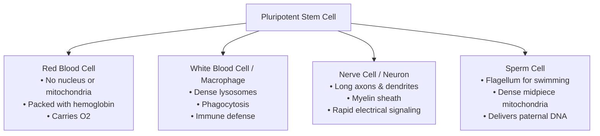

# Honors Cell Investigation Stations

**Source:** `Honors Cell Investigation Stations.pptx.pdf`  
**Course:** Biology I Honors — Unit 2: Cells and Cell Transport  
**Document Type:** Laboratory Stations Guide & Comprehensive Analysis

---

## 📍 Station 1: Macromolecules and Organelles

Macromolecules are the biochemical building blocks of cell organelles and dictate cellular physiology.

### Reference Table: Macromolecules of Life

| Macromolecule Class | Monomer | Polymer | Primary Functions | Representative Examples | Connection to Organelles |
|:---|:---|:---|:---|:---|:---|
| **Carbohydrates** | Monosaccharide (e.g., Glucose) | Polysaccharide (e.g., Starch, Glycogen, Cellulose) | Quick cellular energy; structural rigidity in cell walls | Glucose, Lactose, Cellulose, Chitin | **Cell Wall** (cellulose); **Chloroplast** (synthesizes glucose); **Mitochondria** (oxidizes glucose) |
| **Lipids** | Fatty Acids & Glycerol | Triglycerides, Phospholipids, Steroids | Long-term energy storage; membrane structure; signaling hormones | Phospholipids, Cholesterol, Triglycerides, Estrogen | **Cell Membrane** (phospholipid bilayer, cholesterol); **Smooth ER** (synthesizes lipids) |
| **Proteins** | Amino Acids | Polypeptides / Proteins | Enzymes, transport channels, cellular receptors, structural cytoskeleton | Hemoglobin, Insulin, Enzymes, Myosin, Actin | **Ribosomes** (synthesize proteins); **Rough ER** (folds proteins); **Golgi** (sorts/ships proteins) |
| **Nucleic Acids** | Nucleotides | Polynucleotides (DNA & RNA) | Storage and transmission of genetic instructions for protein synthesis | DNA, mRNA, tRNA, rRNA | **Nucleus** (houses DNA); **Nucleolus** (assembles rRNA); **Mitochondria & Chloroplasts** (own circular DNA) |

---

## 📍 Station 2: Specialized Human Cells

Cell structure is intimately linked to cell function. Specialization alters the abundance and presence of specific organelles:



### Specialized Cell Profiles

1. **Red Blood Cells (Erythrocytes):**
   - **Structural Adaptations:** Eject their nucleus, ribosomes, and mitochondria during maturation to become flexible biconcave discs packed almost entirely with **hemoglobin**.
   - **Functional Rationale:** Lacking mitochondria ensures RBCs do not consume the $O_2$ they transport (they respire via anaerobic glycolysis). The biconcave shape maximizes surface-area-to-volume ratio for gas diffusion and allows cells to bend through microcapillaries. Lifespan is approximately 120 days.
2. **White Blood Cells (Macrophage / Lymphocyte):**
   - **Structural Adaptations:** Abundant **lysosomes** filled with acid hydrolases, flexible plasma membrane capable of forming pseudopodia, and extensive endomembrane systems.
   - **Functional Rationale:** Performs **phagocytosis** to engulf, degrade, and destroy pathogenic bacteria, viruses, and dead cellular debris; produces immune signaling cytokines and antibodies.
3. **Nerve Cells (Neurons):**
   - **Structural Adaptations:** Cell body with branched dendrites, a very long **axon** (up to 1 meter in humans), wrapped in an insulating fatty **myelin sheath**, terminating at synaptic boutons.
   - **Functional Rationale:** Dendrites receive neurotransmitters, while the elongated axon transmits electrical impulses over long distances across the nervous system. The lipid myelin sheath speeds up signal propagation via saltatory conduction.
4. **Sperm Cells (Spermatozoa):**
   - **Structural Adaptations:** Streamlined head housing compact haploid DNA, an acrosome cap containing digestive enzymes, a midpiece packed with **densely arranged mitochondria**, and a long **flagellum**.
   - **Functional Rationale:** The flagellum provides propulsion toward the egg. The clustered mitochondria continuously generate huge amounts of ATP required to power flagellar beating.

---

## 📍 Station 3: Organelles and Human Genetic Disorders

Mutations in DNA that alter organelle enzymes or membrane proteins lead to severe human pathologies:

### Disorder Scenarios & Organelle Diagnosis

1. **Cystic Fibrosis (CF):**
   - **Clinical Presentation:** Chronic cough, frequent respiratory infections, thick sticky mucus accumulating in lungs and digestive tract, difficulty absorbing nutrients.
   - **Defective Organelle / Structure:** **Cell Membrane (specifically the CFTR Chloride Channel Protein).**
   - **Pathophysiology:** A mutation in the *CFTR* gene results in a misfolded or absent integral membrane channel protein. Chloride ions cannot be transported out of epithelial cells into the airway fluid. Without salt export, water fails to follow by osmosis, leaving the extracellular mucus abnormally dehydrated, viscous, and sticky.
2. **Mitochondrial Myopathy / Muscular Dystrophy:**
   - **Clinical Presentation:** Severe progressive muscle weakness, exercise intolerance, cardiac arrhythmias, and neurological impairment.
   - **Defective Organelle:** **Mitochondria.**
   - **Pathophysiology:** High-demand tissues like skeletal muscle and cardiac muscle require vast amounts of ATP. Deficiencies in mitochondrial respiratory chain enzymes drastically impair ATP synthesis, leading to energy starvation and cellular degeneration.
3. **I-Cell Disease (Inclusion-Cell Disease / Mucolipidosis II):**
   - **Clinical Presentation:** Skeletal deformities, coarse facial features, severe developmental delay, failure to thrive, and large intracellular inclusion bodies.
   - **Defective Organelle:** **Golgi Apparatus.**
   - **Pathophysiology:** The Golgi apparatus lacks the phosphotransferase enzyme needed to attach mannose-6-phosphate "shipping tags" onto newly made hydrolytic enzymes. Without this molecular address label, digestive enzymes are mistakenly secreted outside the cell instead of being packaged into lysosomes. The lysosomes become nonfunctional, causing un-degraded substrates to accumulate into dense "inclusions."
4. **Tay-Sachs Disease:**
   - **Clinical Presentation:** Progressive neurodegeneration, loss of motor skills, blindness, seizures, cherry-red spot in retina, and early childhood mortality.
   - **Defective Organelle:** **Lysosomes.**
   - **Pathophysiology:** Inherited mutation causes deficiency of the lysosomal enzyme **hexosaminidase A**. Brain cells cannot hydrolyze the lipid **GM2 ganglioside**. The lipid accumulates to toxic levels within neuronal lysosomes, swelling the lysosomes until neurons burst and die.

---

## 📍 Station 4: Identifying Types of Cellular Transport

### Transport Diagrams & Classification

| Diagram | Observed Molecular Event | Transport Category | Specific Mechanism | Energy Source / Features |
|:---:|:---|:---:|:---|:---|
| **A** | Small solutes moving directly through lipid bilayer down concentration gradient | **Passive** | **Simple Diffusion** | Kinetic energy only; high $
ightarrow$ low; no membrane protein needed |
| **B** | Solutes crossing through a transmembrane channel or carrier protein down gradient | **Passive** | **Facilitated Diffusion** | Kinetic energy only; high $
ightarrow$ low; uses channel/carrier protein |
| **C** | Water molecules moving across a semipermeable membrane toward higher solute | **Passive** | **Osmosis** | Kinetic energy; moves toward lower water potential |
| **D** | Plasma membrane invaginating to take in external liquid droplets or large particles into vesicles | **Active** | **Endocytosis** (Pinocytosis / Phagocytosis) | **ATP required**; bulk inward vesicular transport |
| **E** | Intracellular vesicle fusing with the plasma membrane to release cargo extracellularly | **Active** | **Exocytosis** | **ATP required**; bulk outward vesicular transport |
| **F** | Carrier protein transporting ions ($Na^+/K^+$) against their concentration gradients | **Active** | **Protein Pump ($Na^+/K^+$ ATPase)** | **ATP required**; moves low $
ightarrow$ high; 3 $Na^+$ out, 2 $K^+$ in |

---

## 📍 Station 5: Oddballs of the Natural World — The Protists

Protists are diverse, unicellular eukaryotic organisms displaying remarkable adaptations:

1. **Paramecium (Ciliated Freshwater Protist):**
   - **Locomotion & Feeding:** Completely covered in thousands of rhythmic **cilia** that propel the cell through water and sweep bacteria into its oral groove (cytostome).
   - **Homeostatic Adaptation:** Contains **contractile vacuoles** that rhythmically expand and pump out excess freshwater that enters continuously via osmosis (preventing cytolysis in hypotonic pond water).
2. **Euglena (Mixotrophic Flagellate):**
   - **Dual Nutrition (Mixotrophy):** Contains multiple green **chloroplasts** to perform photosynthesis in sunlight (autotrophy). In darkness, it absorbs organic nutrients or preys on smaller microbes (heterotrophy).
   - **Locomotion & Sensing:** Uses a whip-like anterior **flagellum** to swim toward light, guided by a pigmented **eyespot (stigma)**.
3. **Noctiluca ("Sea Sparkle" Marine Dinoflagellate):**
   - **Colonial / Marine Ecology:** Single-celled balloon-shaped dinoflagellate that forms expansive floating colonies.
   - **Special Properties:** Displays brilliant blue-green **bioluminescence** when disturbed by wave action (luciferin-luciferase reaction). Prolific blooms can produce toxic **red tides**, producing ammonia that depletes dissolved oxygen and harms marine fauna.

---

## 📍 Station 6: The Endomembrane System — Organelles that Build Proteins

Protein synthesis, maturation, and export requires tight chronological coordination among multiple organelles:

```mermaid
sequenceDiagram
    autonumber
    participant N as Nucleus (DNA)
    participant R as Ribosome / Rough ER
    participant V1 as Transport Vesicle
    participant G as Golgi Apparatus
    participant V2 as Secretory Vesicle
    participant M as Plasma Membrane

    N->>R: Transcribes DNA into mRNA; mRNA exits nuclear pore
    R->>R: Ribosome translates mRNA into polypeptide chain inside Rough ER lumen
    R->>V1: ER packages folded immature protein into transport vesicle
    V1->>G: Vesicle fuses with cis-face of Golgi apparatus
    G->>G: Golgi modifies (glycosylation), sorts, and tags protein
    G->>V2: Mature protein packaged into secretory vesicle from trans-face
    V2->>M: Secretory vesicle fuses with plasma membrane
    M->>M: Protein released via Exocytosis or embedded in membrane
```

### Analysis Questions & Key Principles
1. **What happens if ribosomes cease functioning?**
   - *Translation halts completely; no new structural proteins, transport channels, or enzymes can be manufactured, leading to rapid cell death.*
2. **What if vesicles are absent?**
   - *Proteins synthesized on the rough ER would become trapped and could never reach the Golgi apparatus or cell surface for secretion.*
3. **Where are the genetic blueprints for proteins housed?**
   - *Inside the nucleus in the sequence of nitrogenous bases of DNA.*
4. **What is the consequence of DNA mutations?**
   - *Mutations alter the mRNA codon sequence, potentially resulting in incorrect amino acids during translation, causing protein misfolding, nonfunctional active sites, or genetic diseases.*

---

## 📍 Station 7: Microscopic Cell Identification

### Diagnostic Identification Keys

| Cell Specimen | Observed Microscopic Markers | Classification | Biological Evidence & Reasoning |
|:---:|:---|:---|:---|
| **Cell 1 / Specimen A** | Tiny ($<2\ \mu	ext{m}$), absence of defined nucleus, no membrane-bound organelles, peptidoglycan wall, flagella | **Prokaryotic Cell** (Bacteria, e.g., *E. coli*) | Lack of compartmentalization and true nucleus defines prokaryotes |
| **Cell 2 / Specimen B** | Distinct rectangular cell walls, green chloroplasts, large central vacuole pushing nucleus to edge | **Eukaryotic Plant Cell** (e.g., *Elodea* leaf) | Presence of chloroplasts and rigid cellulose wall confirms plant cell |
| **Cell 3 / Specimen C** | Irregular, rounded boundaries, visible nucleus and dark nucleolus, absence of cell wall and chloroplasts | **Eukaryotic Animal Cell** (e.g., Human cheek cell) | Flexible membrane without wall, distinct nucleus and lysosomes confirm animal cell |
| **Cell 4 / Specimen D** | Unicellular eukaryote with visible cilia or flagella, active contractile vacuoles, food vacuoles | **Eukaryotic Protist** (e.g., *Amoeba* or *Paramecium*) | Single-celled eukaryote displaying specialized organelles for motility and osmoregulation |
