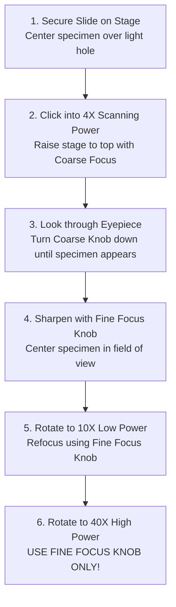

# Microscope Parts & Use

**Source:** `Microscope Parts & Use PPT.pdf`  
**Course:** Biology I Honors — Unit 2: Cells and Cell Transport  
**Document Type:** Laboratory Manual & Technical Guide

---

## 🛡️ 1. Care, Handling, and Safety Rules

Proper handling ensures precision optical alignment and prevents costly equipment damage:

1. **Two-Hand Transport:** Always carry the microscope using **two hands** — firmly grasp the **arm** with your dominant hand and support the **base** with your other hand. Keep the microscope held vertically against your chest.
2. **Optical Cleaning:** Clean all glass optical surfaces (eyepiece and objective lenses) using **ONLY specialized lens paper**. Never use paper towels, laboratory tissues (Kimwipes), or clothing fibers, which contain abrasive wood pulp that will permanently scratch delicate lens coatings.
3. **Gentle Mechanical Adjustment:** Never force focus knobs or mechanical stages past their stops. If a knob resists turning, alert your instructor.
4. **Cord & Workspace Management:** Position the microscope at least 4 inches away from desk edges. Coil excess power cord neatly to prevent tripping or catching.

---

## 🔬 2. Anatomy & Parts of the Compound Light Microscope

```
                    [ Eyepiece / Ocular Lens (10X) ]
                                  |
                           [ Body Tube ]
                                  |
                      [ Revolving Nosepiece ]
                       /         |         \
                 [4X Obj]    [10X Obj]    [40X Obj]
                                 |
                           [   Stage   ]  <--- [Stage Clips]
                                 |
                           [ Diaphragm ]
                                 |
                          [ Light Source ]
                                 |
                      =======================
                             [ Base ]
```

### Component Functions & Descriptions

| Part | Mechanical / Optical Role | Operating Guidelines |
|:---|:---|:---|
| **Eyepiece (Ocular Lens)** | Lens you look through; contains internal magnifying lens (usually **10X**) | May contain a black pointer line used to point out specific structures |
| **Body Tube (Eyepiece Tube)** | Hollow cylinder connecting ocular lens to nosepiece | Maintains correct optical path distance |
| **Revolving Nosepiece** | Rotating circular turret holding objective lenses | Turn by gripping the turret ring (not by grabbing the lenses directly) until it clicks |
| **Objective Lenses** | Set of interchangeable magnification lenses: • **Scanning (4X):** Shortest, red ring • **Low Power (10X):** Medium, yellow ring • **High Power (40X):** Longest, blue ring | Primary magnification source; length increases with magnification power |
| **Stage** | Flat horizontal platform upon which the glass slide is placed | Center the specimen directly over the central stage aperture hole |
| **Stage Clips / Arm** | Metal clips or mechanical slide bracket holding slide firmly | Gently clamp slide so it does not drift during viewing |
| **Diaphragm (Iris)** | Rotating disc beneath stage with varying aperture openings | Adjusts the cone of light, contrast, and depth of field reaching the specimen |
| **Light Source (Illuminator)**| Substage lamp or mirror reflecting light upward | Turn off when not in use to preserve bulb life |
| **Arm** | Sturdy curved metal backbone connecting stage and optics | Main carrying grip of the microscope |
| **Base** | Heavy weighted bottom foundation | Provides physical stability on the lab bench |
| **Coarse Adjustment Knob** | Large outer knob that moves stage up and down significantly | **ONLY USE ON SCANNING (4X) POWER.** Never use on high power! |
| **Fine Adjustment Knob** | Small inner knob that moves stage infinitesimally | Used on medium (10X) and high (40X) power for precise, crisp focusing |

---

## 🎯 3. Step-by-Step Focusing Protocol

To quickly find and focus on specimens without breaking slides:



> [!CAUTION]
> **HIGH POWER RULE:** Once the revolving nosepiece is switched to the **40X high-power objective**, **NEVER touch the coarse adjustment knob**. The 40X lens sits less than 1 mm above the glass coverslip. Turning the coarse focus on high power will drive the lens through the glass slide, cracking the slide and destroying the precision lens.

---

## 📐 4. Optical Calculations: Magnification & Resolution

### Total Magnification Formula
$$	ext{Total Magnification} = 	ext{Ocular Lens Magnification} 	imes 	ext{Objective Lens Magnification}$$

### Magnification Calculation Table
| Objective Lens | Ocular Lens Power | Objective Lens Power | Total Magnification Calculation | Total Magnification |
|:---|:---:|:---:|:---:|:---:|
| **Scanning Power (Red)** | $10	ext{X}$ | $4	ext{X}$ | $10 	imes 4$ | **$40	ext{X}$** |
| **Low Power (Yellow)** | $10	ext{X}$ | $10	ext{X}$ | $10 	imes 10$ | **$100	ext{X}$** |
| **High Power (Blue)** | $10	ext{X}$ | $40	ext{X}$ | $10 	imes 40$ | **$400	ext{X}$** |

### Resolution vs. Magnification
- **Magnification:** The degree to which an image appears enlarged relative to the actual physical object.
- **Resolution (Resolving Power):** The minimum distance between two points at which they can still be distinguished as separate, distinct entities. Without high resolution, increasing magnification merely produces a larger, blurrier image (empty magnification).

---

## 🔬 5. Comparison of Scientific Microscopes

Modern biology utilizes distinct microscope modalities depending on specimen preparation and experimental goals:

| Microscope Type | Illuminating Beam | Specimen State | Max Useful Magnification | Image Format | Distinct Advantages & Applications |
|:---|:---|:---|:---:|:---:|:---|
| **Compound Light Microscope (LM)** | Visible Light photons | **Living or preserved** | $\sim 1,000	ext{X} - 1,500	ext{X}$ | 2D color view | Can observe living cellular processes (cyclosis, motility, mitosis); easy slide preparation |
| **Transmission Electron Microscope (TEM)** | High-energy electron beam transmitted *through* ultra-thin sliced specimen | **Dead / Fixed / Dehydrated** | Up to **$1,000,000	ext{X}$** | 2D black & white ultrastructure | Highest resolution; visualizes internal organelle architecture (cristae, ribosomes, nuclear pores) |
| **Scanning Electron Microscope (SEM)** | Electron beam *sweeping over* specimen surface coated with heavy metals | **Dead / Fixed / Metal-coated** | Up to **$100,000	ext{X}$** | **Striking 3D surface topography** | Exceptional depth of field; reveals realistic 3D exterior shapes of cells, pollen, and viruses |
